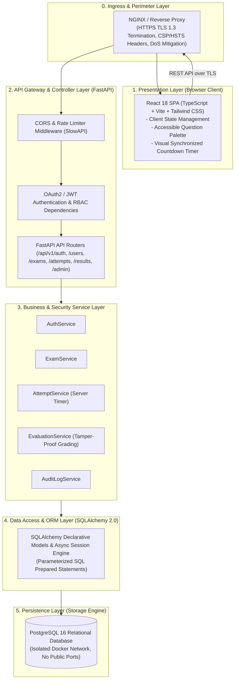

# SecureExam — System Architecture and Structural Design

## Document Information
- **Project**: SecureExam — Secure Online Examination Management System
- **Institution**: Amrita School of Computing
- **Course**: Secure Software Engineering
- **Version**: 1.0.0
- **Status**: Baselined (Phase 2)
- **Target Course Outcomes**: CO1 (Secure System Models), CO2 (Threat Modeling), CO3 (Containerization)

---

## 1. Architectural Overview & Design Philosophy

SecureExam is architected as a **Security-Hardened Modular Monolith**, striking an optimal balance between strict modular separation of concerns and operational maintainability without the latency, network overhead, and distributed transaction complexity of microservices.

### 1.1 Core Architectural Principles
1. **Zero-Trust Perimeter**: Every incoming request across trust boundaries is treated as untrusted, regardless of source IP or client claims.
2. **Server Authoritative Control**: The client browser is treated as an insecure display terminal. All security decisions, timing policies, and grading evaluations are authoritatively computed and enforced by backend services.
3. **Defense-in-Depth**: Layered security controls span from HTTP ingress filtering and TLS termination to strict Pydantic payload validation, RBAC checks, parameterized ORM persistence, and audit emission.
4. **Least Privilege**: Users and processes operate with minimal necessary rights: students can only access their own submissions, faculty can only mutate their own exams, and database containers run on isolated networks with dedicated unprivileged system users.

---

## 2. Logical Layered Architecture



### 2.1 Layer Responsibilities & Isolation
- **Presentation Layer**: Implemented using React 18 and TypeScript. Responsible solely for user interface rendering, form submission, and local client state. Does NOT perform authorization or final score calculations.
- **API & Controller Layer**: Implemented via FastAPI APIRouter modules. Responsible for request dispatching, input deserialization, Pydantic v2 validation, HTTP response formatting, and status codes.
- **Security Middleware & Interceptor Layer**: Sits between HTTP ingress and controllers. Intercepts incoming requests to apply CORS policies, inspect bearer JWTs, enforce rate limits, and sanitize dangerous inputs.
- **Service Layer**: Encapsulates pure business logic, workflows, cryptographic operations, authoritative timer calculations, and evaluation algorithms. Contains zero controller/HTTP coupling.
- **Data Access Layer**: Implemented via SQLAlchemy 2.0. Translates domain entities into parameterized SQL queries, guaranteeing immunity against SQL injection vulnerabilities.
- **Persistence Layer**: PostgreSQL 16 relational database enforcing relational integrity, foreign key cascading constraints, unique constraints, and ACID transactions.

---

## 3. Major Subsystems & Module Specifications

### 3.1 Authentication Subsystem (`core/security.py`, `services/auth_service.py`, `api/v1/auth.py`)
- **Responsibility**: User registration, credential verification, Argon2id hashing, and cryptographically signed JWT issuance.
- **Inputs**: Registration payload (name, email, password), Login payload (email, password).
- **Outputs**: Access token (`bearer`), token expiration metadata, sanitized user profile.
- **Dependencies**: `passlib[argon2]`, `pyjwt`, `UserRepository`, `AuditLogService`.
- **Security Responsibility**: Enforces password complexity (minimum 10 chars, uppercase, lowercase, digit, special character), generic failure responses (anti-enumeration), and brute-force rate limits (max 10 req/min). Direct dependency.

### 3.2 User Management Subsystem (`services/user_service.py`, `api/v1/users.py`)
- **Responsibility**: User profile retrieval, profile updates, and self-service account details.
- **Inputs**: Authenticated user context (`current_user`), profile update payloads.
- **Outputs**: Serialized user profile DTO.
- **Dependencies**: `UserRepository`, `AuditLogService`.
- **Security Responsibility**: Verifies that users can only read and mutate their own profile data. Direct dependency.

### 3.3 Exam Management Subsystem (`services/exam_service.py`, `api/v1/exams.py`)
- **Responsibility**: Exam CRUD, status transitions (`DRAFT` -> `PUBLISHED` -> `CLOSED`), availability time window enforcement, exam catalog queries.
- **Inputs**: Exam creation payload (title, description, duration, passing score), exam ID, faculty context.
- **Outputs**: Exam DTO, list of available exams (sanitized for students).
- **Dependencies**: `ExamRepository`, `Sanitizer`, `AuditLogService`.
- **Security Responsibility**: Enforces strict faculty ownership checks (BOLA/IDOR prevention). Students can only query `PUBLISHED` exams whose current time falls within `[start_date, end_date]`. Direct dependency.

### 3.4 Question Management Subsystem (`services/question_service.py`, `api/v1/questions.py`)
- **Responsibility**: Authoring, updating, and removing questions and choice options for examinations.
- **Inputs**: Question prompt, 4 choices, designated correct choice ID, point weight, explanation.
- **Outputs**: Question entity with options.
- **Dependencies**: `ExamRepository`, `QuestionRepository`, `Sanitizer`.
- **Security Responsibility**: Sanitizes HTML tags from prompts and choices using `bleach`. Strips `is_correct` and `explanation` from student-facing API responses before an exam is submitted. Direct dependency.

### 3.5 Exam Attempt Subsystem (`services/attempt_service.py`, `api/v1/attempts.py`)
- **Responsibility**: Orchestrating examination sessions, initializing authoritative server timers, storing intermediate candidate selections, and enforcing time limit closures.
- **Inputs**: Exam ID, Student ID, answer choice submissions.
- **Outputs**: Attempt session metadata (Attempt ID, `started_at`, `expires_at`, remaining seconds), submission confirmation.
- **Dependencies**: `AttemptRepository`, `ExamRepository`, `EvaluationService`, `AuditLogService`.
- **Security Responsibility**: Authoritative server timer calculation: `expires_at = started_at + duration`. Hard rejection of submissions arriving after `expires_at + grace_period` (15 seconds). Direct dependency.

### 3.6 Evaluation Subsystem (`services/evaluation_service.py`)
- **Responsibility**: Server-authoritative automated grading, percentage computation, and tamper-proof grade sealing.
- **Inputs**: Attempt ID, student selected option IDs.
- **Outputs**: Sealed Result record (total marks awarded, percentage, grade status).
- **Dependencies**: `AttemptRepository`, `QuestionRepository`, `ResultRepository`, `AuditLogService`.
- **Security Responsibility**: Ignores any client-supplied scores. Retrieves official correct keys directly from database, verifies selections, and locks result against modification. Direct dependency.

### 3.7 Result Management Subsystem (`services/result_service.py`, `api/v1/results.py`)
- **Responsibility**: Querying and displaying evaluated performance records and statistical breakdowns.
- **Inputs**: Attempt ID or Exam ID, User context.
- **Outputs**: Candidate result card, faculty class grade distribution.
- **Dependencies**: `ResultRepository`, `ExamRepository`.
- **Security Responsibility**: Enforces object-level ownership: students can only access results where `result.student_id == current_user.id`. Faculty can only inspect results for exams they own. Direct dependency.

### 3.8 Administration Subsystem (`services/admin_service.py`, `api/v1/admin.py`)
- **Responsibility**: Platform governance, user activation/deactivation, role reassignments, and system-wide exam inspection.
- **Inputs**: Target User ID, status payload, role payload.
- **Outputs**: Updated administrative user records, platform summary statistics.
- **Dependencies**: `UserRepository`, `ExamRepository`, `AuditLogService`.
- **Security Responsibility**: Protected by `require_role(Role.ADMIN)`. Emits high-priority audit logs on every role modification and account deactivation. Direct dependency.

### 3.9 Audit Logging Subsystem (`core/audit_logger.py`, `services/audit_service.py`, `api/v1/audit.py`)
- **Responsibility**: Tamper-evident logging of security transactions into an append-only relational table.
- **Inputs**: Event type, actor ID, actor role, IP address, target resource, outcome.
- **Outputs**: Paginated, filterable audit log stream (accessible strictly by Administrator).
- **Dependencies**: `AuditLogRepository`, `DBSession`.
- **Security Responsibility**: Strict write-only capability for general services; read-only for Admin. Sanitizes payloads to ensure passwords, tokens, and keys are NEVER recorded. Direct dependency.

---

## 4. Cross-Cutting Security Controls & Mechanisms

| Control Area | Architectural Implementation | Mechanism |
| :--- | :--- | :--- |
| **Authentication** | `core/security.py` | Argon2id password hashing + JWT with 60-minute expiration. |
| **RBAC** | `api/deps.py` | FastAPI `Depends(require_role)` injecting claims from cryptographically validated tokens. |
| **Object Authorization** | Service Layer checks | BOLA/IDOR protection verifying `resource.owner_id == user.id`. |
| **Input Validation** | Pydantic v2 schemas | Schema enforcement (`extra="forbid"`), regex formats, and boundary constraints. |
| **SQLi Prevention** | SQLAlchemy 2.0 ORM | 100% Parameterized prepared statements; zero raw string interpolation. |
| **XSS Prevention** | `core/sanitizer.py` + React | Backend HTML tag stripping via `bleach` + React native JSX escaping. |
| **Rate Limiting** | SlowAPI (Token bucket) | 100 req/min general, 10 req/min authentication endpoints. |
| **Security Headers** | SecurityHeaders Middleware | Injects CSP (`default-src ''self''`), X-Content-Type-Options (`nosniff`), X-Frame-Options (`DENY`), HSTS. |
| **CORS Policy** | CORSMiddleware | Strictly bound to authorized frontend origin domain; no wildcard `*` with credentials. |
| **Audit Logging** | Append-only Audit Table | Relational audit record created synchronously on all state-altering operations. |

---

## 5. Deployment Architecture

### 5.1 Production Containerized Deployment
```mermaid
flowchart TD
    subgraph WAN ["Public Ingress (Port 443/80)"]
        InternetClient["Browser Client"]
    end

    subgraph HostVM ["Host Machine (Docker Swarm / Compose)"]
        subgraph IngressBridge ["ingress-net (Public Bridge)"]
            Proxy["NGINX Reverse Proxy\n(TLS Termination, Port 443 & 80)"]
        end

        subgraph AppNetwork ["app-net (Internal Docker Network)"]
            Frontend["Frontend Web Container\n- Unprivileged Nginx\n- User: appuser (UID 10001)\n- Port: 80"]
            Backend["Backend API Container\n- FastAPI + Uvicorn\n- User: appuser (UID 10001)\n- Port: 8000"]
        end

        subgraph DBNetwork ["db-net (Isolated Docker Network)"]
            PostgreSQL[("PostgreSQL 16 DB\n- Port: 5432 (Internal Only)\n- User: secureexam_user\n- Volume: pgdata")]
        end
    end

    InternetClient -->|HTTPS (TLS 1.3)| Proxy
    Proxy -->|Forward / | Frontend
    Proxy -->|Forward /api/ | Backend
    Backend -->|Connection Pool (Port 5432)| PostgreSQL
```

### 5.2 Network Segmentation & Isolation
- **Ingress Network (`ingress-net`)**: Exposes ports 80 (HTTP redirect) and 443 (HTTPS) to the public internet. Hosts only the Reverse Proxy.
- **Application Network (`app-net`)**: Connects Reverse Proxy, Frontend, and Backend. No external ports are mapped directly to host interfaces for Frontend or Backend.
- **Database Network (`db-net`)**: Isolated internal network linking Backend to PostgreSQL. The PostgreSQL container **DOES NOT** bind port 5432 to the host network interface, completely isolating database persistence from external network probing and brute-force attacks.

### 5.3 Development vs. Production Architecture Comparison
| Attribute | Development Architecture | Production Architecture |
| :--- | :--- | :--- |
| **Ingress** | Direct port binding (Vite :5173, FastAPI :8000) | NGINX Reverse Proxy on Port 443 with TLS 1.3 |
| **Database** | SQLite Async (`sqlite+aiosqlite`) / Local PostgreSQL | Multi-container PostgreSQL 16 on isolated network |
| **Reload Mode** | Hot reloading enabled (`uvicorn --reload`, Vite HMR) | Disabled (`workers=4`, precompiled static assets) |
| **Security Headers** | Basic CORS for local development | Strict CSP, HSTS (`max-age=31536000`), no-sniff |
| **Logging** | Console stdout debug level | Structured JSON audit logging to database & rotated file |
| **Container Privilege**| Root / Host developer user | Non-root `appuser` (UID 10001) |

---

## 6. Coupling, Dependency Analysis & Security Boundaries

### 6.1 Security & Trust Boundaries
- **Trust Boundary 1 (Client to Perimeter)**: Untrusted browser environment communicating over public internet to Reverse Proxy. Mitigated by TLS 1.3, CSP, CORS, and rate limiting.
- **Trust Boundary 2 (Perimeter to API Routers)**: Semi-trusted ingress forwarded to FastAPI. Mitigated by Pydantic deserialization, schema validation, and JWT verification.
- **Trust Boundary 3 (API to Service Layer)**: Authenticated context passing to business logic. Mitigated by RBAC checks and object-level ownership checks (BOLA/IDOR).
- **Trust Boundary 4 (Application to Database)**: Service layer persisting to PostgreSQL. Mitigated by parameterized SQLAlchemy statements and network isolation.

### 6.2 Sensitive Assets & Threat Points
1. **User Credentials**: Passwords protected by Argon2id; tokens protected by HMAC-SHA256 signature and short 60-minute expiry.
2. **Examination Answer Keys**: Stored in `questions.correct_option_id`; explicitly excluded from student API responses until exam window expiration.
3. **Examination Timers**: Authoritatively managed in `exam_attempts.expires_at`; evaluated against server system clock on every submission.
4. **Student Grades & Transcripts**: Tamper-proof calculation in `EvaluationService`; read-only enforcement in `results` table.
5. **Audit Logs**: Stored in append-only table `audit_logs` without mutation endpoints.

### 6.3 Coupling Hotspots & Future Dependency Reduction Plan
- **Current Coupling Hotspot**: `EvaluationService` interacts directly with `AttemptRepository`, `QuestionRepository`, and `ResultRepository`.
- **Target for Phase 36 (Dependency Reduction)**: Decouple evaluation into an isolated `EvaluationStrategy` interface that receives pure data records rather than managing multi-table repository transactions directly. This eliminates circular coupling risks and reduces cyclomatic complexity.
